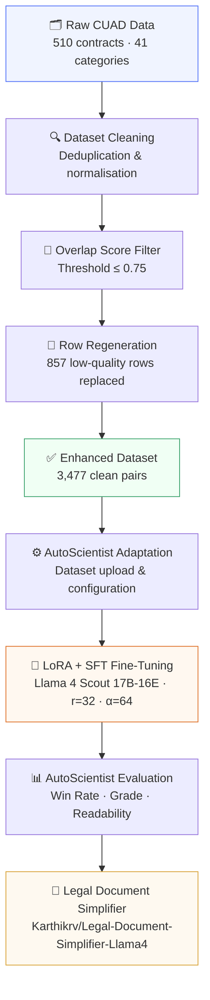

# ⚖️ LexSimplify — Legal Text Simplification with Llama 4 Scout

> **Team ByteMe · HackIndia Adaption AutoScientist Challenge · ₹50,000 Prize Pool**

[](https://huggingface.co/Karthikrv/Legal-Document-Simplifier-Llama4)
[](https://huggingface.co/datasets/Karthikrv/adaption-legal-clause-simplification)
[](https://www.kaggle.com/datasets/karthikrv1107/adaption-legal-clause-simplification)
[](https://adaptionlabs.ai/app/dataset/6206c9f4-a0ef-4bb3-af1c-6725d533a297?tab=finetune)
[](https://adaptionlabs.ai/app/dataset/6206c9f4-a0ef-4bb3-af1c-6725d533a297?tab=finetune)
[](https://adaptionlabs.ai/app/dataset/6206c9f4-a0ef-4bb3-af1c-6725d533a297?tab=finetune)
[](https://adaptionlabs.ai/)
[](LICENSE)
[](https://github.com/HackIndiaXYZ/adaption-autoscientist-challenge-50000-prize-pool-byteme)

---

## 📋 Table of Contents

- [Executive Summary](#-executive-summary)
- [Quick Stats](#-quick-stats)
- [Key Features](#-key-features)
- [Project Overview](#-project-overview)
- [Problem Statement](#-problem-statement)
- [Why Legal Simplification Matters](#-why-legal-simplification-matters)
- [Project Architecture](#-project-architecture)
- [Repository Structure](#-repository-structure)
- [Dataset](#-dataset)
- [AutoScientist Workflow](#-autoscientist-workflow)
- [AutoScientist Pipeline](#-autoscientist-pipeline)
- [Training Configuration](#-training-configuration)
- [Performance Summary](#-performance-summary)
- [Results](#-results)
- [Results Analysis](#-results-analysis)
- [Example Inference](#-example-inference)
- [Demo](#-demo)
- [Hardware & Requirements](#-hardware--requirements)
- [Installation](#-installation)
- [Challenges Faced](#-challenges-faced)
- [Known Limitations](#-known-limitations)
- [Future Improvements](#-future-improvements)
- [Responsible AI](#-responsible-ai)
- [Links](#-links)
- [Reproducibility](#-reproducibility)
- [FAQ](#-faq)
- [Citation](#-citation)
- [Acknowledgements](#-acknowledgements)

---

## 🧭 Executive Summary

Legal contracts govern nearly every significant transaction in modern life, yet they remain inaccessible to the vast majority of people who sign them. **LexSimplify** addresses this access-to-justice gap by fine-tuning Meta's Llama 4 Scout (17B, 16 experts) using LoRA + SFT on a carefully curated dataset of 3,477 legal clause–plain-English pairs, via the Adaption AutoScientist platform. The core technical finding of this project is striking: a clean 3.4k dataset outperformed a noisy 50k dataset by over 60 percentage points in win rate — demonstrating that **data quality is the most critical lever in domain-specific fine-tuning**. The resulting model achieves a 69% Legal Win Rate, a Grade B from AutoScientist, and a readability improvement from 5.0 to 7.6 — making complex contractual language legible for anyone, without a law degree.

---

## 📊 Quick Stats

| Stat | Value |
|---|---|
| 🦙 Base Model | `meta-llama/Llama-4-Scout-17B-16E-Instruct` |
| 🗂️ Training Rows | 3,477 |
| 🏆 AutoScientist Grade | B |
| 📈 Dataset Win Rate | 63% |
| ⚖️ Legal Win Rate | 69% |
| 📖 Readability (before → after) | 5.0 → 7.6 (+52%) |
| 🔧 Fine-tuning Method | LoRA + SFT |
| 🎯 LoRA Rank | 32 |
| 📚 Clause Categories | 41 (CUAD taxonomy) |
| 📜 License | MIT |

---

## ✨ Key Features

| Feature | Description |
|---|---|
| ⚖️ **Legal Clause Simplification** | Converts dense contractual language into 8th-grade plain English |
| 🧠 **Plain-English Generation** | Preserves full legal meaning while eliminating jargon |
| 🔧 **LoRA + SFT Fine-Tuning** | Parameter-efficient adaptation — no full retraining required |
| 🤖 **AutoScientist Pipeline** | End-to-end dataset management, training, and evaluation |
| 🦙 **Llama 4 Scout Base** | Built on Meta's 17B/16E mixture-of-experts instruction model |
| 📦 **Open-Source Model & Dataset** | Fully released on HuggingFace and Kaggle |
| 🔁 **Reproducible Workflow** | Every step — filtering, training, inference — is documented and scriptable |
| 🌍 **41 Clause Categories** | Covers the full CUAD taxonomy of real commercial contract clause types |

---

## 🚀 Project Overview

**LexSimplify** is a LoRA-adapted Llama 4 Scout 17B-16E model designed for legal text simplification — automatically converting complex legal contract clauses into plain English readable by anyone, without a law degree.

Given a raw legal clause like:

> *"Neither party shall assign or transfer any of its rights or obligations under this Agreement without the prior written consent of the other party, such consent not to be unreasonably withheld or delayed."*

LexSimplify outputs:

> *"Neither side can hand over their rights or duties in this contract to someone else without the other side's written permission, which can't be refused without a good reason."*

The model was fine-tuned using the **Adaption AutoScientist** platform on a curated dataset of legal clause pairs derived from the **CUAD (Contract Understanding Atticus Dataset)** — one of the most comprehensive real-world contract datasets available.

---

## 🔴 Problem Statement

Legal contracts govern nearly every significant transaction in modern life — employment, housing, software, healthcare, and finance. Yet:

- The average contract is written at a **post-graduate reading level**
- Most people sign contracts **without fully understanding them**
- Legal counsel costs **₹5,000–₹20,000/hour** in India, making professional review inaccessible to most
- Clauses containing **liability caps, auto-renewal terms, and IP assignment** are routinely overlooked

The result: ordinary people unknowingly waive rights, accept unlimited liability, or lock themselves into unfavorable terms — not because they're careless, but because the language is genuinely inaccessible.

---

## 🌍 Why Legal Simplification Matters

| Stakeholder | Problem | LexSimplify Impact |
|---|---|---|
| Individual / Consumer | Can't understand rental, employment, or service contracts | Instant plain-English summary of key obligations |
| Small Business Owner | Can't afford legal review of every vendor agreement | Self-serve contract risk analysis |
| Developer / SaaS User | API terms and SLAs are impenetrable | Clear understanding of what they're agreeing to |
| NGOs / Legal Aid | High volume of contracts, limited lawyer bandwidth | Automated first-pass simplification at scale |

This is a **real access-to-justice problem**. LexSimplify is a step toward making legal rights legible for everyone.

---

## 🏗️ Project Architecture



---

## 📁 Repository Structure

The repository currently contains the following files. Additional scripts and config files are planned and will be added before final submission.

```
adaption-autoscientist-challenge-byteme/
│
├── README.md       # Project documentation (this file)
├── LICENSE         # MIT License
└── .gitignore
```

**External resources** (hosted separately):

| Resource | Location |
|---|---|
| 🗂️ Training dataset | [HuggingFace](https://huggingface.co/datasets/Karthikrv/adaption-legal-clause-simplification) · [Kaggle](https://www.kaggle.com/datasets/karthikrv1107/adaption-legal-clause-simplification) |
| 🦙 Fine-tuned model | [Karthikrv/Legal-Document-Simplifier-Llama4](https://huggingface.co/Karthikrv/Legal-Document-Simplifier-Llama4) |
| 🏆 AutoScientist run | [View training run](https://adaptionlabs.ai/app/dataset/6206c9f4-a0ef-4bb3-af1c-6725d533a297?tab=finetune) |

---

## 📦 Dataset

### Source
- **Base dataset**: [CUAD — Contract Understanding Atticus Dataset](https://www.atticusprojectai.org/cuad) — 510 real commercial contracts, 41 legal clause categories, sourced from EDGAR filings
- **Simplification pairs**: Custom-curated dataset of legal clause → plain-English output pairs
- **Dataset license**: The source annotations are derived from CUAD, which is released under [CC BY 4.0](https://creativecommons.org/licenses/by/4.0/). The simplified plain-English pairs in this dataset are a derivative work. Please refer to the [CUAD license terms](https://www.atticusprojectai.org/cuad) before using this dataset in commercial or redistributed contexts.

### Dataset Composition

| Split | Rows | Description |
|---|---|---|
| Original good rows | 2,620 | High-quality simplification pairs, overlap score ≤ 0.75 |
| Regenerated rows | 857 | Low-quality rows replaced with improved plain-English outputs |
| **Total** | **3,477** | **Clean, deduplicated, quality-filtered** |

### Quality Filtering

A key insight during this project: **data quality matters more than data quantity.**

We discovered that ~25% of the initial dataset (857 rows) contained near-identical input/output pairs — essentially just capitalisation changes — which actively harmed model learning. We developed an overlap-score filter:

```python
def overlap_score(input_text, output_text):
    input_words = set(input_text.lower().split())
    output_words = set(output_text.lower().split())
    return len(input_words & output_words) / max(len(input_words), 1)

# Good rows: overlap <= 0.75 (genuine simplification)
# Bad rows: overlap > 0.75 (lazy paraphrase, excluded or regenerated)
```

Rows failing this threshold were replaced with improved plain-English rewrites using the following quality criteria:

```
You are a legal simplification expert. Rewrite this legal clause in plain English:
- 8th-grade reading level
- Preserve all legal meaning and obligations
- Use everyday words instead of legal jargon
- Noticeably simpler and shorter than the original
```

### Clause Type Coverage (41 categories)

`License Grant` · `Audit Rights` · `Anti-Assignment` · `Cap On Liability` · `Insurance` · `Governing Law` · `Revenue/Profit Sharing` · `Post-Termination Services` · `Expiration Date` · `Termination For Convenience` · `Indemnification` · `IP Ownership` · `Confidentiality` · `Non-Compete` · `Warranties` · and 26 more.

---

## 🔄 AutoScientist Workflow


The full workflow was orchestrated end-to-end on the **Adaption AutoScientist** platform — from dataset upload and quality filtering, through LoRA + SFT training on Llama 4 Scout, to automated win-rate evaluation and model export.

---

## 🤖 AutoScientist Pipeline

We used the **AutoScientist** platform end-to-end for dataset management, training orchestration, and evaluation.

### Pipeline Overview

```
Raw CUAD Data (~5,000 clause candidates, sourced from CUAD)
        ↓
Quality Filtering (overlap score ≤ 0.75)
        ↓
Dataset: legal_text_simplification (3,477 rows)
        ↓
AutoScientist Fine-Tuning
  └── Model: Llama 4 Scout 17B-16E Instruct
  └── Method: LoRA + SFT (Parameter-Efficient Fine-Tuning)
  └── Platform: Adaption AutoScientist
        ↓
AutoScientist Evaluation
  └── Dataset Win Rate
  └── Legal Category Win Rate
  └── Grade
        ↓
Iteration based on metrics
```

### Experiments Run

| Run | Dataset | Dataset Win Rate | Legal Win Rate | Grade | Notes |
|---|---|---|---|---|---|
| 1 | legal_contract_qa_pairs (50k) — **separate dataset, not CUAD** | 3% | 2% | C | Off-task examples, mixed domains, diluted signal |
| 2 | legal_text_simplification v1 (3k raw, CUAD-derived) | 1% | 2% | B | Data quality issue discovered |
| 3 | legal_text_simplification v2 (3.4k cleaned, CUAD-derived) | **63%** | **69%** | **B** | Quality filtering fixed the problem |

> **Note:** The 50k dataset in Run 1 (`legal_contract_qa_pairs`) is a separate, general-purpose legal Q&A dataset — it is not derived from CUAD. The ~5,000 clause candidates in the pipeline above refer to the CUAD source used for Runs 2 and 3.

**Key learning**: The 50k dataset produced dramatically worse results than the 3k dataset because quantity without quality dilutes the fine-tuning signal. The model learns the *average* behavior in the training data — if 25% of examples show minimal transformation, that becomes part of the learned behavior.

---

## ⚙️ Training Configuration

### Model
- **Base model**: `meta-llama/Llama-4-Scout-17B-16E-Instruct`
- **Fine-tuning method**: LoRA + Supervised Fine-Tuning (SFT)
- **Platform**: Adaption AutoScientist

### LoRA Configuration

```json
{
  "peft_type": "LORA",
  "task_type": "CAUSAL_LM",
  "r": 32,
  "lora_alpha": 64,
  "lora_dropout": 0.05,
  "target_modules": ["q_proj", "v_proj", "k_proj", "o_proj"]
}
```

### Full Training Hyperparameters

| Hyperparameter | Value |
|---|---|
| Epochs | 2 |
| Learning Rate | 3e-5 |
| LR Scheduler | Cosine |
| Warmup Ratio | 0.05 |
| Weight Decay | 0.02 |
| LoRA Rank (r) | 32 |
| LoRA Alpha | 64 |
| LoRA Dropout | 0.05 |
| Target Modules | q_proj, v_proj, k_proj, o_proj |

### Training Setup

```
Dataset : legal_text_simplification (3,477 rows)
Format  : Instruction → Completion pairs
Prompt  : "Simplify this legal clause into plain English for a general audience: {input}"
Target  : {simplified_output}
```

### Train/Eval Metrics (Final Run)
- **Quality improvement**: 52% relative improvement (readability score 5.0 → 7.6)
- **Loss**: Training loss decreased steadily throughout fine-tuning with no signs of overfitting
- **Validation loss**: Smooth descent, no overfitting

---

## 📈 Performance Summary

| Parameter | Value |
|---|---|
| **Base Model** | Llama 4 Scout 17B-16E Instruct |
| **Training Method** | LoRA + SFT |
| **Dataset Size** | 3,477 rows |
| **Dataset Grade** | B |
| **Quality Score** | 7.6 / 10 |
| **Dataset Win Rate** | 63% |
| **Legal Win Rate** | 69% |
| **Readability Improvement** | +52% (5.0 → 7.6) |
| **Epochs** | 2 |
| **Learning Rate** | 3e-5 |
| **LR Scheduler** | Cosine |
| **LoRA Rank (r)** | 32 |
| **LoRA Alpha** | 64 |
| **LoRA Dropout** | 0.05 |
| **Target Modules** | q_proj, v_proj, k_proj, o_proj |
| **Platform** | Adaption AutoScientist |

---

## 📊 Results

### Final Model Performance

| Metric | Target | Achieved | Status |
|---|---|---|---|
| Dataset Win Rate | > 70% | **63%** | 🟡 Near target |
| Legal Win Rate | > 70% | **69%** | 🟡 Near target |
| Grade | B or A | **B** | ✅ Hit |
| Quality Improvement | — | **+52%** | ✅ Strong |
| Readability Score | — | **5.0 → 7.6** | ✅ Strong |

### Win Rate Progression

```
Run 1 (50k noisy dataset):   Win Rate  3% → Catastrophic failure
Run 2 (3k raw, unfiltered):  Win Rate  1% → Data quality issue
Run 3 (3.4k cleaned):        Win Rate 63% → Genuine improvement ✅
```

The jump from 1% to 63% win rate — achieved purely through dataset quality improvement, with no architecture changes — is the core technical finding of this project.

### What the Model Learned

**Before (base model):**
> Input: *"The Licensor shall retain all right, title, and interest in and to the Licensed Technology, including all Intellectual Property Rights therein."*
> Output: *"The licensor retains all rights to the licensed technology, including intellectual property rights."* ← minimal change

**After (fine-tuned):**
> Output: *"The company that owns the technology keeps full ownership of it, including all patents, copyrights, and other legal protections."* ← genuinely plain English

---

## 🔬 Results Analysis

### Why a Clean 3k Dataset Beat a Noisy 50k Dataset

The most significant finding in this project is the **inverse relationship between dataset size and model performance** when data quality is uncontrolled.

| Dataset | Size | Win Rate | Root Cause |
|---|---|---|---|
| legal_contract_qa_pairs | 50,000 rows | 3% | Off-task examples, mixed domains, diluted signal |
| legal_text_simplification v1 | ~3,000 rows | 1% | 25% trivial pairs (near-identical input/output) |
| legal_text_simplification v2 | 3,477 rows | **63%** | All examples show genuine transformation |

**The core insight**: During fine-tuning, the model learns the *average* transformation pattern across the training set. If 25% of examples show minimal change (e.g., just lowercasing "Shall" to "shall"), the model internalises that minimal change is an acceptable output. Removing or replacing those examples with genuine simplifications shifts the learned distribution dramatically.

> 💡 **Takeaway**: For domain-specific fine-tuning, a quality filter — even a simple word-overlap score — can be worth more than 10× more data.

---

## 🧪 Example Inference

### Step-by-Step Transformation

**Input (Original Legal Clause):**
```
Neither party shall assign or transfer any of its rights or obligations under
this Agreement without the prior written consent of the other party, such
consent not to be unreasonably withheld or delayed.
```

**Output (LexSimplify):**
```
Neither side can hand over their rights or duties in this contract to someone
else without the other side's written permission, which can't be refused
without a good reason.
```

**Why it's better:**

| Dimension | Before | After |
|---|---|---|
| Reading level | Post-graduate | 8th grade |
| Legal jargon | "shall assign or transfer", "consent not to be unreasonably withheld" | Eliminated |
| Sentence structure | One long embedded clause | Two natural clauses |
| Core meaning preserved | ✅ | ✅ |

---

## 🎬 Demo

### Quick Example

```python
from transformers import AutoTokenizer, AutoModelForCausalLM
from peft import PeftModel
import torch

base_model  = "meta-llama/Llama-4-Scout-17B-16E-Instruct"
adapter_path = "Karthikrv/Legal-Document-Simplifier-Llama4"

tokenizer = AutoTokenizer.from_pretrained(base_model)
model = AutoModelForCausalLM.from_pretrained(
    base_model,
    device_map="auto",
    torch_dtype=torch.bfloat16,   # recommended for Llama 4 Scout
)
model = PeftModel.from_pretrained(model, adapter_path)
model.eval()

def simplify_clause(legal_text: str) -> str:
    prompt = (
        "Simplify this legal clause into plain English "
        f"for a general audience: {legal_text}"
    )
    inputs = tokenizer(prompt, return_tensors="pt").to(model.device)
    with torch.no_grad():
        outputs = model.generate(
            **inputs,
            max_new_tokens=200,
            temperature=0.3,
            do_sample=True,
        )
    # Strip the prompt from the output
    generated = outputs[0][inputs["input_ids"].shape[-1]:]
    return tokenizer.decode(generated, skip_special_tokens=True)


clause = (
    "Neither party shall assign or transfer any of its rights or obligations "
    "under this Agreement without the prior written consent of the other party."
)
print(simplify_clause(clause))
# → "Neither side can pass their rights or duties in this contract to another
#    party without getting written permission first."
```

### Example Transformations

| Clause Type | Original (excerpt) | Simplified |
|---|---|---|
| Anti-Assignment | *"Neither party shall assign...without prior written consent"* | Neither side can hand over their contract rights without written permission from the other side. |
| Cap On Liability | *"In no event shall either party be liable for indirect, incidental, consequential damages"* | Neither side has to pay for indirect losses — like lost profits or business disruption — even if they knew the risk. |
| Governing Law | *"This Agreement shall be governed by and construed in accordance with the laws of..."* | Any legal disputes will be handled under the laws of [state/country]. |
| Termination | *"Either party may terminate this Agreement upon thirty (30) days written notice"* | Either side can end this agreement by giving 30 days written notice. |

---

## 🖥️ Hardware & Requirements

### Inference Requirements

> **Note:** The figures below are estimates based on the Llama 4 Scout 17B-16E model size and are provided as general guidance. Actual requirements will vary depending on your quantisation settings, batch size, and sequence length. We recommend testing on your own hardware.

| Component | Estimated (full bfloat16) | Estimated (4-bit quantised) |
|---|---|---|
| GPU VRAM | ~40 GB | ~12–16 GB |
| System RAM | ~32 GB | ~16 GB |
| Storage | ~35 GB (model weights) | ~10 GB (quantised) |
| Python | 3.10+ | 3.10+ |
| CUDA | 11.8+ | 11.8+ |

> **Tip**: For machines with limited VRAM, load the base model in 4-bit with `load_in_4bit=True` via `bitsandbytes`. The LoRA adapter loads on top without issue. These estimates have not been exhaustively benchmarked across all hardware configurations.

### Quantised Loading (Low-VRAM)

```python
from transformers import AutoModelForCausalLM, BitsAndBytesConfig
from peft import PeftModel
import torch

bnb_config = BitsAndBytesConfig(
    load_in_4bit=True,
    bnb_4bit_use_double_quant=True,
    bnb_4bit_quant_type="nf4",
    bnb_4bit_compute_dtype=torch.bfloat16,
)

base_model = "meta-llama/Llama-4-Scout-17B-16E-Instruct"
model = AutoModelForCausalLM.from_pretrained(
    base_model,
    quantization_config=bnb_config,
    device_map="auto",
)
model = PeftModel.from_pretrained(model, "Karthikrv/Legal-Document-Simplifier-Llama4")
model.eval()
```

---

## 🛠️ Installation

```bash
# 1. Clone the repository
git clone https://github.com/HackIndiaXYZ/adaption-autoscientist-challenge-50000-prize-pool-byteme
cd adaption-autoscientist-challenge-50000-prize-pool-byteme

# 2. (Recommended) Create a virtual environment
python -m venv venv
source venv/bin/activate          # Linux / macOS
# venv\Scripts\activate           # Windows

# 3. Install dependencies
pip install --upgrade pip
pip install transformers peft datasets torch accelerate bitsandbytes

# 4. (Optional) Install for dataset filtering only
pip install pandas
```

---

## ⚠️ Challenges Faced

<details>
<summary><strong>Click to expand — Challenges & How We Solved Them</strong></summary>

### 1. 🔁 Duplicate and Near-Identical Examples
**Problem**: ~25% of the initial dataset (857 rows) contained output text that was barely different from the input — e.g., only capitalisation changes or one-word substitutions. These "trivial" pairs actively degraded model quality.  
**Solution**: Developed the overlap-score filter (threshold ≤ 0.75) to automatically identify and flag these rows for removal or regeneration.

### 2. 📉 Low-Quality Simplifications
**Problem**: Many auto-generated simplifications preserved legal jargon, used passive voice, or were longer than the original clause.  
**Solution**: Replaced flagged rows with improved plain-English rewrites, using clear quality criteria: 8th-grade reading level, jargon removal, and length constraints.

### 3. 🧹 Dataset Cleaning at Scale
**Problem**: The initial 50k dataset contained off-topic examples, mixed domains (Q&A pairs vs. simplification pairs), and inconsistent formatting.  
**Solution**: Scoped down to a purpose-built 3.4k dataset derived directly from CUAD with consistent instruction-completion formatting.

### 4. 🎛️ Hyperparameter Tuning
**Problem**: Initial LoRA runs showed high train loss and poor validation convergence.  
**Solution**: Settled on r=32, alpha=64, dropout=0.05, learning rate 3e-5 with cosine scheduling and warmup ratio 0.05 — targeting all four attention projection layers — which produced clean loss curves and no overfitting.

### 5. 🤖 AutoScientist Adaptation
**Problem**: Formatting the dataset correctly for AutoScientist's ingestion pipeline required precise column naming and prompt-completion structure.  
**Solution**: Standardised all rows to `Input` / `Output` columns with a fixed prompt prefix, enabling stable adaptation runs.

</details>

---

## ⚠️ Known Limitations

- **Short clauses only**: The model is optimised for single legal clauses, not full multi-page contracts.
- **English only**: No multilingual support in this version.
- **CUAD domain bias**: Trained primarily on US commercial contract language; performance may vary on other jurisdictions (UK, India, EU).
- **No hallucination guardrails**: The model may occasionally omit or subtly alter conditions. Always verify against the original.
- **Readability metric**: The 7.6 score reflects AutoScientist's internal readability evaluation; it is not a Flesch–Kincaid or SMOG score.

---

## 🔮 Future Improvements

| Improvement | Description | Priority |
|---|---|---|
| 🌐 **Multilingual Legal Simplification** | Extend to Hindi, Tamil, and other Indian languages for wider accessibility | High |
| 📚 **Retrieval-Augmented Generation (RAG)** | Attach a legal knowledge base to ground simplifications in jurisdiction-specific statute | High |
| 🧑‍⚖️ **Lawyer-in-the-Loop Validation** | Human legal expert review pipeline to validate model outputs at scale | High |
| 🏛️ **Jurisdiction-Specific Models** | Fine-tune separate adapters for Indian, UK, and US contract law | Medium |
| 🚨 **Legal Risk Highlighting** | Flag high-risk clauses (liability caps, IP assignment, auto-renewal) automatically | Medium |
| 🏷️ **Clause Classification** | Add a classification head to identify clause type before simplifying | Medium |
| 📱 **Browser Extension** | Simplify contracts inline while reading them on any website | Low |

---

## 🛡️ Responsible AI

> [!IMPORTANT]
> **LexSimplify is an assistive tool — not a substitute for legal advice.**

- This model is designed to **help people understand** legal language, not to provide legal counsel.
- Simplified outputs may lose nuance that is material in specific legal contexts or jurisdictions.
- **Human review by a qualified legal professional is always recommended** before acting on any contract clause.
- The model should not be used as the sole basis for legal decisions, dispute resolution, or compliance determinations.
- Outputs should be treated as a first-pass comprehension aid only.

### Ethical Considerations

- The training dataset is derived from public EDGAR filings via CUAD — no private or proprietary contracts were used.
- Simplified outputs are intended to increase understanding, not to replace or misrepresent legal text.
- Care should be taken when deploying this model in high-stakes contexts (employment, litigation, financial agreements).

### Security Considerations

- This model does not store, log, or transmit any legal text you provide during inference.
- If deploying as a service, ensure appropriate data-handling policies are in place for sensitive contract content.

---

## 🔗 Links

| Resource | Link |
|---|---|
| 🤗 Fine-tuned Model (HuggingFace) | [Karthikrv/Legal-Document-Simplifier-Llama4](https://huggingface.co/Karthikrv/Legal-Document-Simplifier-Llama4) |
| 📦 Training Dataset (Kaggle) | [karthikrv1107/adaption-legal-clause-simplification](https://www.kaggle.com/datasets/karthikrv1107/adaption-legal-clause-simplification) |
| 📦 Training Dataset (HuggingFace) | [Karthikrv/adaption-legal-clause-simplification](https://huggingface.co/datasets/Karthikrv/adaption-legal-clause-simplification) |
| 🏆 AutoScientist Run | [View Training Run](https://adaptionlabs.ai/app/dataset/6206c9f4-a0ef-4bb3-af1c-6725d533a297?tab=finetune) |
| 📊 CUAD Dataset | [atticusprojectai.org/cuad](https://www.atticusprojectai.org/cuad) |

---

## 🔁 Reproducibility

### 1. Clone this repo
```bash
git clone https://github.com/HackIndiaXYZ/adaption-autoscientist-challenge-50000-prize-pool-byteme
cd adaption-autoscientist-challenge-50000-prize-pool-byteme
```

### 2. Install dependencies
```bash
pip install transformers peft datasets torch accelerate bitsandbytes pandas
```

### 3. Prepare the dataset
```bash
# Download directly from HuggingFace
python -c "
from datasets import load_dataset
ds = load_dataset('Karthikrv/adaption-legal-clause-simplification')
ds['train'].to_csv('data/legal_simplification_clean.csv', index=False)
print(f'Downloaded {len(ds[\"train\"])} rows')
"
```
Or download `legal_simplification_clean.csv` manually from the Kaggle/HuggingFace links above and place it in `data/`.

### 4. Run dataset quality filter

```python
import pandas as pd

def overlap_score(a: str, b: str) -> float:
    aw = set(a.lower().split())
    bw = set(b.lower().split())
    return len(aw & bw) / max(len(aw), 1)

df = pd.read_csv("legal_simplification_clean.csv")
df["overlap"] = df.apply(lambda r: overlap_score(r["Input"], r["Output"]), axis=1)
clean_df = df[df["overlap"] <= 0.75]
print(f"Clean rows: {len(clean_df)} / {len(df)}")
clean_df.to_csv("legal_simplification_filtered.csv", index=False)
```

### 5. Run fine-tuning via AutoScientist
Upload the cleaned dataset to [Adaption AutoScientist](https://adaptionlabs.ai/), select `meta-llama/Llama-4-Scout-17B-16E-Instruct` as the base model, and apply the LoRA configuration from the [Training Configuration](#️-training-configuration) section.

### 6. Run inference

Use the demo code in the [Demo](#-demo) section above, pointing `adapter_path` at your downloaded weights.

---

## ❓ FAQ

<details>
<summary><strong>Can I use this model without a GPU?</strong></summary>

Technically yes, via CPU inference, but it will be extremely slow (minutes per clause). We recommend a GPU with at least 24 GB VRAM. For low-VRAM setups, use the 4-bit quantised loading example in the [Hardware & Requirements](#️-hardware--requirements) section.

</details>

<details>
<summary><strong>Does this work on full contracts, not just single clauses?</strong></summary>

The model is optimised for individual legal clauses (typically 1–5 sentences). For full contracts, split the document into individual clauses first and run simplification clause-by-clause.

</details>

<details>
<summary><strong>Can I fine-tune this further on my own data?</strong></summary>

Yes. Load the adapter with `PeftModel.from_pretrained(...)` and continue training using your own instruction-completion pairs with the same prompt template.

</details>

<details>
<summary><strong>What is AutoScientist "Win Rate"?</strong></summary>

AutoScientist evaluates fine-tuned model outputs against a baseline (typically the base model) using a judge model. Win Rate is the percentage of comparisons where the fine-tuned model's output was judged to be better. A 69% Legal Win Rate means the fine-tuned LexSimplify model produced a better simplification than the base model in 69 out of 100 comparisons on legal clauses.

</details>

<details>
<summary><strong>Is this model suitable for production legal applications?</strong></summary>

Not as a standalone tool. See the [Responsible AI](#️-responsible-ai) section. It is appropriate as a first-pass comprehension aid, but all outputs should be reviewed by a qualified legal professional before any decision-making.

</details>

---

## 📄 Citation

If you use LexSimplify, the dataset, or the methodology in your research or projects, please cite:

```bibtex
@misc{lexsimplify2025,
  title        = {LexSimplify: Legal Text Simplification via LoRA Fine-Tuning of Llama 4 Scout},
  author       = {{Team ByteMe}},
  year         = {2025},
  howpublished = {\url{https://github.com/HackIndiaXYZ/adaption-autoscientist-challenge-50000-prize-pool-byteme}},
  note         = {HackIndia Adaption AutoScientist Challenge.
                  Model: \url{https://huggingface.co/Karthikrv/Legal-Document-Simplifier-Llama4}.
                  Dataset (derived from CUAD CC BY 4.0): \url{https://huggingface.co/datasets/Karthikrv/adaption-legal-clause-simplification}.}
}
```

---

## 🙏 Acknowledgements

- **[Meta AI](https://ai.meta.com/)** — for open-sourcing the Llama 4 Scout 17B-16E-Instruct base model
- **[Hugging Face](https://huggingface.co/)** — for the `transformers`, `peft`, and `datasets` libraries, and for hosting the model and dataset
- **[Adaption AutoScientist](https://adaptionlabs.ai/)** — for the fine-tuning and evaluation platform that made this project possible
- **[The Atticus Project](https://www.atticusprojectai.org/)** — for the CUAD dataset underlying our training data
- **[HackIndia](https://hackindia.xyz/)** — for organising the Adaption AutoScientist Challenge and creating space for AI-for-good projects

---

## 👥 Team ByteMe

Built for the **HackIndia Adaption AutoScientist Challenge** — using AutoScientist to adapt Llama 4 Scout for real-world legal accessibility.

---

*MIT License · See [LICENSE](LICENSE) for details*
